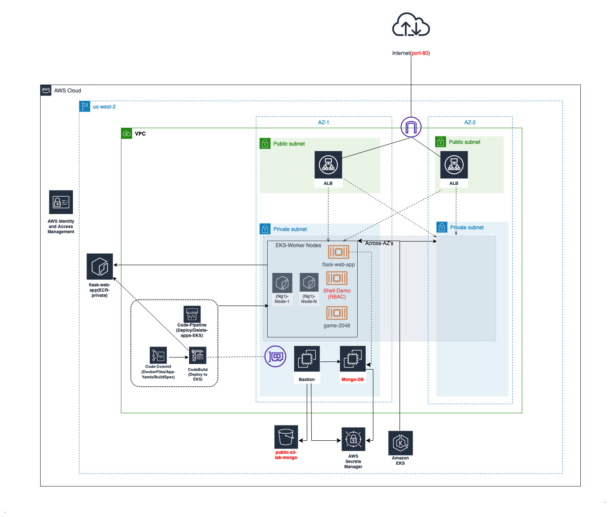

 ⚠️WARNING⚠️ This is to test a Vulnerable deployment, Use caution when using this code as referance ⚠️WARNING⚠️

### Primary Resources deployed by this code
* VPC with 3 subnets, bastion, mongodb, secretsmanager for mongo secret, EKS, EKS-ALB addon, OIDC Provider for RBAC, S3 Bucket(Public), Cluster Role for Pods
* Public for ALB's
* Private for most of AWS Resources 
* Intra for EKS COntrol Panel 

### Architecture Diagram 

* Modules and Git Repos are locally downloaded to avoid any git pinning and custom code changes
 
### Process 

Infra:- 

1) Create a bucket for terraform tfstate and updte it in provider-backend.tf (can be automated)
2) validate lab-variables.auto.tfvars with required inputs
3) ` Terraform init`
   
    `Terraform apply`

### CICD - Pipeline can be run at this point to deploy sample web apps 

#### CICD (Authenticate with ECR and Kubectl)

1) Navigate to cicd and validate variables
`terraform init && terraform apply`

2) Push-yaml to push-yaml-coderepo from root  to trigger pipelines

 Run `sh deploy-pipeline.sh`

#### Now start Pipeline `Deploy-apps-eks` to deploy apps to EKS

### Access Public bucket (Get this from terraform or from AWS console in s3 service)

`https://{bucketname}.s3.us-west-2.amazonaws.com/`

### To terminate ec2 example from MongoDB Instance (Mongo Instance have ec2*, but bastion has no elevated access)

`aws ec2 terminate-instances --region us-west-2 --instance-ids i-xxx `

## EKS

### Make sure you have  aws-session-manager(for logging to ec2's, alternatively you can also use key-pair if enabled in variables and in tf ec2-*.tf code), eksctl and kubectl arte also required. 

## Push any updated Flask-web-app code to ECR or update ECR image.

## Deploying EKS apps manually and testing 
### Notes:- Sg info copied has to eks yaml file due to some bug with annotation/versions

1) Update kubeconfig
`aws eks update-kubeconfig --region us-west-2 --name eks-lab`

2) Apply yaml config to deploy web app  - port 80
*  update security group ID in annotation (tem workaround) with name alb_security_group_eks_custom from vpc security groups- alb.ingress.kubernetes.io/security-groups: sg-02c62xxxxxx

*  `kubectl apply -f eks-sample-apps/2048_full.yaml`
*  `kubectl get ingress/ingress-2048 -n game-2048`

##### More info on alb addon installation in main.tf - https://docs.aws.amazon.com/eks/latest/userguide/alb-ingress.html

3) Flask web app with MngoDB

 `kubectl apply -f eks-sample-apps/flask-web-app.yaml`
 
 `kubectl get ingress/ingress-flask-web-app -n flask-web-app`
 
3) privileged container deployment 

`kubectl apply -f eks-sample-apps/shell-demo.yaml`

`kubectl exec --stdin --tty shell-demo -- /bin/bash`

####  * Lab-eks-pod-cluster-admin service account was mapped to a custom cluster-admin role with admin privilages 
####  * Test cluster-admin custom role access for a pod which was provided via RBAC

`kubectl exec --stdin --tty shell-demo -- /bin/bash`

`apt-get update`

`apt-get install -y curl`

`curl -LO "https://dl.k8s.io/release/$(curl -L -s https://dl.k8s.io/release/stable.txt)/bin/linux/amd64/kubectl"`

`install -o root -g root -m 0755 kubectl /usr/local/bin/kubectl`

`kubectl get pods -A`

#### * Test AWS IAM Access for pods with write access to s3
#### * The roles defined in lab-eks-pod-cluster-admin aka eks-service-account-role have s3:GetBucket", "s3:GetObject", "s3:PutObject access on * 

`apt-get update`

`apt-get install -y awscli`

`touch test-rbac`

`aws s3api put-object --bucket test44242 --key test-rbac --body ./test-rbac`

###  Future Improvements
1) ec2-key need to be created manually. We don't actaully need any key nor a public subnet for bastion,  use session manager to login to bastion 
2) Tags can be appended to IAM and S3 to support multi env deploymenet within same AWS Account
3) More cleanup within Security Groups
4) AWS Secrets manager addon for kubernetes 
5) Cleanup of Readonly Public S3 Bucket, MongoDB IAM permissions, RBAC-Cluster Admin

### Troubleshooting commands

`aws secretsmanager delete-secret --secret-id mongoadminUserpassword --force-delete-without-recovery --region us-west-2`

### Secrets manager should be in place before mongo and bastion works

### Login to bastion using ssm 

`aws ssm start-session --region us-west-2 --target i-00xxxxx`
`sudo su - ec2-user`
`curl "https://s3.amazonaws.com/session-manager-downloads/plugin/latest/linux_64bit/session-manager-plugin.rpm" -o "session-manager-plugin.rpm"`
`sudo rpm -ivh sess*`

### Some of Modules refrenced and blogs referred from 
1) https://github.com/terraform-aws-modules/terraform-aws-eks
2) https://github.com/KPRepos/terraform-ecs-app
3) https://towardsdatascience.com/how-to-deploy-a-flask-api-in-kubernetes-and-connect-it-with-other-micro-services-af16965b67fe
4) https://chat.openai.com/chat
5) https://towardsdatascience.com/how-to-deploy-a-flask-api-in-kubernetes-and-connect-it-with-other-micro-services-af16965b67fe
6) https://tf-eks-workshop.workshop.aws/500_eks-terraform-workshop.html
7) https://hackmd.io/@pmanzoni/r1uWcTqfU

## Userdata scripts

1) templates/app_user_data.sh = This is mongodb userdata that creates an admin password retreived from secrets manager and creates a dummy collection of data such that backups can work.

2) templates/bastion_user_data.sh = This is for bastion ec2, which will create a cron job to connect to mongodb and initaie backup, mongodb password info will be retrieved from secrets manager.
